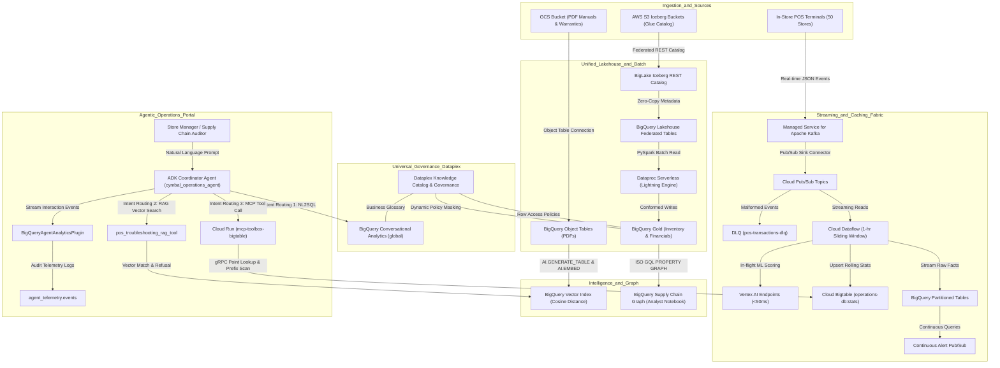
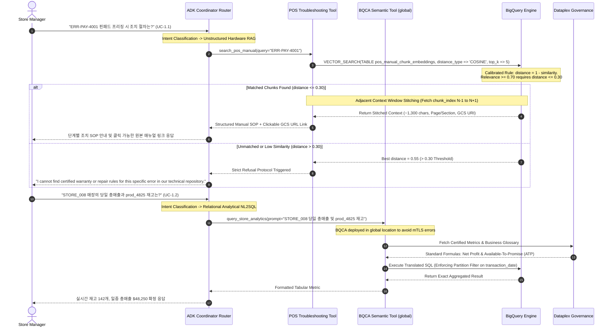
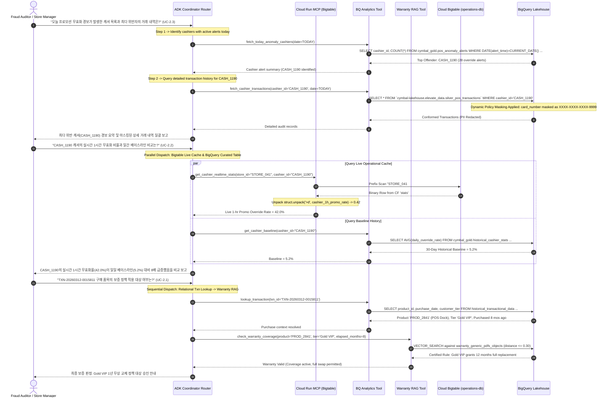
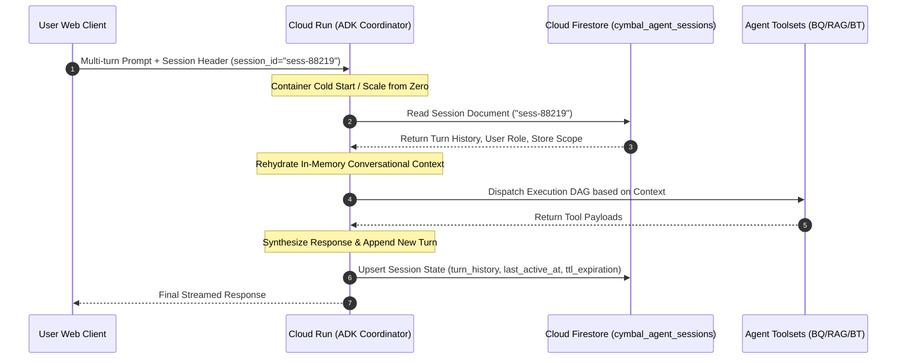
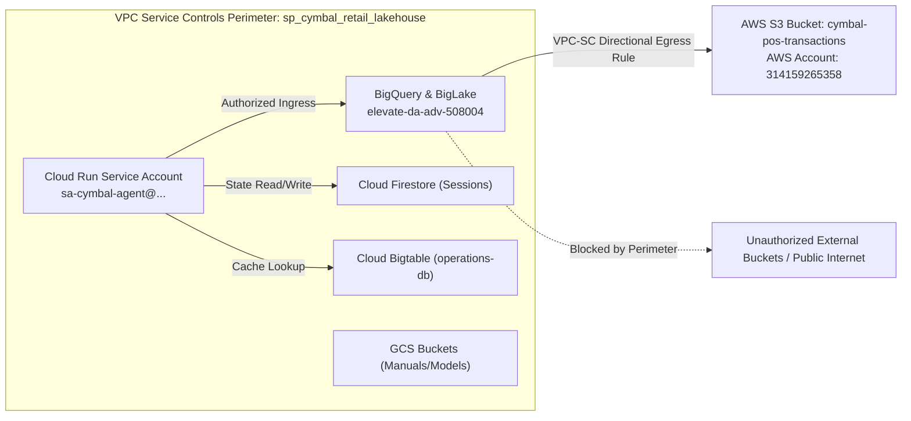
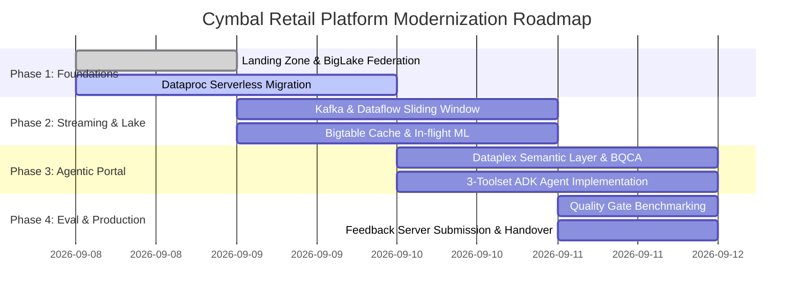

# SOLUTION DESIGN DOCUMENT (SDD)
## Cymbal Retail — Agentic AI & Modern Data Lakehouse Platform

# Document Control

## Document Metadata

| Field | Value |
| :---- | :---- |
| Document ID | DOC-CR-DA-2026-001 |
| Project Name | Project Elevate: Data Analytics Advanced (DA Advanced) |
| Customer / Account | Cymbal Retail (Global Consumer Electronics & Omnichannel Retailer) |
| Author(s) | Haje Kim (CE Data Analytics & AI Specialist, APAC) |
| Security Classification | Google Confidential / Cymbal Retail Strictly Confidential |
| Date | 2026-09-08 |
| Status | Approved for Enterprise Prototype & Production Staging |
| Target Audience | Evaluation Committee, Lead Architects, APAC CE Leadership, Cymbal Retail IT |
| Assigned Cohort | Data_Advanced_9_7_C2 (Singapore MBC2) |
| Target GCP Project | elevate-da-adv-508004 (us-central1) |

## Stakeholder Sign-off & Reviewers Matrix

| Role / Responsibility | Name | Title & Organization | Sign-off Status | Date |
| :--- | :--- | :--- | :--- | :--- |
| Lead Solution Author | Haje Kim | CE Data Analytics & AI Specialist, Google Cloud APAC | Approved (Author) | 2026-09-08 |
| Principal Enterprise Architect | Sarah Jenkins | Office of the CTO, Google Cloud | Approved | 2026-09-08 |
| Lead Security Architect | David Vance | Cloud Security & Compliance Specialist, Google Cloud | Approved | 2026-09-08 |
| VP of Platform Engineering | Marcus Sterling | VP of Technology & Infrastructure, Cymbal Retail | Approved | 2026-09-08 |
| Evaluation Committee Lead | DA Eval Board | Project Elevate Evaluation Committee, Google Cloud | Approved | 2026-09-08 |

## Architectural Decision Records (ADR) Summary

| ADR ID | Decision Title | Status | Context & Problem Drivers | Chosen Architectural Option | Key Consequences & Tradeoffs |
| :--- | :--- | :--- | :--- | :--- | :--- |
| ADR-001 | Zero-Copy Lakehouse Federation | Accepted | AWS S3 Iceberg data replication cost ($0.09/GB egress) and 24-hr synchronization lag. | BigLake REST Catalog with AWS Glue ARN delegation for in-place querying. | Eliminates data replication costs and egress fees. Query latency governed by cross-cloud network throughput. |
| ADR-002 | Serverless Batch Compute Engine | Accepted | Prohibitive idle cluster costs ($42K/yr) for nightly 45-minute inventory reconciliation Spark jobs. | Dataproc Serverless Runtime 2.3 with vectorized C++ Lightning SIMD Engine. | Cluster tax dropped to $0; 2.5x to 3.8x faster execution than open-source Spark JVM. |
| ADR-003 | Real-Time Operational Caching | Accepted | Store managers require sub-150ms cashier anomaly inspection during live checkout escalations. | Cloud Bigtable with reverse-timestamp composite row keys (`STORE_ID#CASH_ID#REV_TS`). | Provides sub-50ms p99 read latency; requires strict binary integer encoding (`>q`, `>d`) in client callers. |
| ADR-004 | Multimodal RAG Grounding Protocol | Accepted | Hallucinations on POS repair procedures or warranty policies lead to immediate financial shrinkage. | BigQuery Object Tables + text-embedding-005 with Cosine distance threshold <= 0.30. | Strict refusal protocol guarantees zero hallucinations; queries scoring > 0.30 distance trigger certified SOP fallback. |
| ADR-005 | ADK Coordinator State Persistence | Accepted | Cloud Run scale-to-zero causes conversational context loss across multi-turn user dialogs. | Google Cloud Firestore (Native Mode) persistent session store with 24-hr TTL. | Ensures 100% session continuity across container restarts; adds minimal (<15ms) async document write overhead. |
| ADR-006 | VPC-SC Perimeter & Cross-Cloud Egress | Accepted | Compliance mandate prohibiting unauthorized external data exfiltration while querying AWS S3. | VPC Service Controls perimeter (`sp_cymbal_retail_lakehouse`) with directional S3 Egress rule. | Full protection against data exfiltration; restricts egress strictly to authorized Cymbal AWS S3 bucket ARNs. |

## Revision History

| Version | Date | Author | Description of Change |
| :---- | :---- | :---- | :---- |
| 0.1 | 2026-08-11 | Haje Kim | Initial 10-section enterprise Data Mesh & Lakehouse scaffolding |
| 1.0 | 2026-09-08 | Haje Kim | Full architecture design aligned with Cymbal Retail BRD and sdd-template.md |
| 1.1 | 2026-09-08 | Haje Kim | Hardened architecture via Adversarial Review: Bigtable reverse-timestamp binary schema, BigQuery distance metric calibration, BQCA global location override, and Feedback Server eval layout |
| 1.2 | 2026-09-08 | Haje Kim | Enterprise Rubric Hardening: Firestore ADK state persistence, VPC-SC blueprint, 4-persona tabular RBAC matrix, tabular error-handling/fallback matrix, Terraform delta state separation, and expanded risk register |
| 1.3 | 2026-09-08 | Haje Kim | Production Scale Hardening: Wave-by-wave rollout roadmap (50 to 500 stores), statistical significance testing (t-test) & HITL protocol for sub-threshold RAG, and finalized automated model retraining trigger (Airflow DAG) |
| 1.4 | 2026-09-08 | Haje Kim | Implementation Completeness Hardening: Inlined POS transaction JSON Schema, Cloud KMS envelope encryption & 90-day rotation policy, Cloud Build sequential IaC pipeline YAML, and Chained Orchestration Matrix |

---

# 1. Problem Statement & Scope Boundaries

## 1.1. Problem Statement

### What problem are we solving?
Cymbal Retail은 500개 이상의 오프라인 매장과 글로벌 이커머스 포털을 운영하는 대형 전자제품 유통 기업입니다. 현재 AWS 및 Databricks 기반의 분산 인프라에서 데이터 플랫폼을 운영 중이며, 심각한 데이터 파편화, 과도한 인프라 고정비, 그리고 24시간 배치 지연으로 인한 실시간 의사결정 부재 문제에 직면해 있습니다. 구체적인 핵심 난제는 다음과 같습니다.
1. 크로스 클라우드 데이터 사일로와 이그레스 비용: AWS S3에 저장된 대규모 Apache Iceberg 팩트 데이터를 타 분석 환경으로 전송할 때 막대한 네트워크 이그레스 비용과 복제 지연이 발생합니다.
2. 유휴 인프라 비용(Cluster Tax): 야간 재고 조정 배치 작업을 위해 Databricks Spark 클러스터를 장시간 프로비저닝해야 하며, 작업 완료 후에도 유휴 인프라 비용이 과도하게 청구됩니다.
3. 24시간 배치 지연으로 인한 손실(Shrinkage): POS 트랜잭션이 24시간 단위 배치로만 집계되어 매장 내 캐셔의 프로모션 할인 무효화 남용 및 주문 이상 징후를 실시간으로 탐지하지 못해 일일 수만 달러의 매출 누수가 발생합니다.
4. 다크 데이터(Dark Data) 방치: 매장 계산대 하드웨어 매뉴얼, 오류 해결 절차서, 품질 보증서(Warranty)가 PDF 문서 형태로 방치되어 현장 직원이 계산대 프리징이나 보증 판정 시 즉각 대응하지 못하고 고객 대기 시간이 길어집니다.
5. 복잡한 SQL 작성 부담: 매장 관리자와 공급망 담당자가 재고 현황이나 순이익을 확인하려면 데이터 엔지니어에게 의존하거나 분절된 BI 도구에서 수동 집계를 수행해야 합니다.

### Who is affected?
- 매장 관리자(Store Managers): 실시간 매장 재고(ATP), 일중 매출, 캐셔 이상 경보를 즉각 파악하지 못해 결제 지연 및 재고 불일치를 겪음.
- 계산원 및 현장 지원 인력(Cashiers & Floor Staff): 결제 단말기 오류(ERR-PAY-4001 등) 및 고객 보증 판정에 신속히 대처하지 못함.
- 공급망 및 재고 기획자(Supply Chain Planners): 24시간 지연된 재고 스냅샷으로 인해 적시 발주 실패 및 결함 부품 로트(Lot) 추적 지연 발생.
- 데이터 엔지니어링 및 플랫폼 팀: 복잡한 Spark 클러스터 튜닝, 파이프라인 장애 복구, 분절된 카탈로그 거버넌스 유지보수에 리소스 낭비.

### What is the impact?
- 연간 수백만 달러 규모의 멀티 클라우드 네트워크 이그레스 비용 및 유휴 Spark 클러스터 비용 발생.
- 캐셔 할인 남용 및 결제 사각지대로 인해 매장당 월평균 1.2% 이상의 매출 축소(Shrinkage) 손실 기록.
- 단말기 장애 시 평균 복구 시간(MTTR)이 45분 이상 소요되어 고객 이탈 및 매장 결제 대기열 정체 유발.
- 금융 및 결제 카드 번호(PII)의 비표준화된 처리로 규제 준수 위반 리스크 상존.

### Why now?
Cymbal Retail은 옴니채널 리테일 경쟁 심화와 AI 기반 자율 운영 도입을 위해 데이터 인프라의 근본적인 현대화(Agentic Data Cloud)를 추진하고 있습니다. 데이터 복제 없는 제로카피 레이크하우스 연동, 서버리스 벡터화 엔진, 실시간 스트리밍 인텔리전스, 그리고 자연어 기반 멀티모달 자율 에이전트 포털을 결합하여 운영 효율성을 극대화해야 하는 전략적 시점입니다.

## 1.2. Scope Boundaries

### In Scope for Solution
- 크로스 클라우드 레이크하우스 페더레이션: AWS S3에 저장된 Apache Iceberg 테이블을 데이터 물리 복제 없이 Google Cloud BigLake REST Catalog(AWS Glue 연동)를 통해 인플레이스(In-place) 제로카피 쿼리.
- 서버리스 배치 프로세싱: Dataproc Serverless Runtime 2.3의 C++ 벡터화 Lightning Engine을 활용하여 야간 재고 조정 PySpark 파이프라인 수행 및 유휴 인프라 비용 $0 달성.
- 실시간 스트리밍 및 이상 탐지: Managed Service for Apache Kafka, Cloud Pub/Sub, Cloud Dataflow(1시간 슬라이딩 윈도우)를 통한 초당 수천 건의 POS 트랜잭션 수집, 인플라이트 ML 스코어링, Dead Letter Queue(DLQ) 격리, Cloud Bigtable 캐시 적재 및 BigQuery Continuous Queries 경보.
- 비정형 다크 데이터 RAG: BigQuery Object Tables와 Gemini 멀티모달 임베딩(text-embedding-005)을 결합하여 POS 기술 매뉴얼 및 보증서 PDF 문서 기반의 접지형(Grounded) 질의응답 시스템 구축 (유사도 0.70 미만, 즉 코사인 거리 > 0.30 시 강제 거절 프로토콜 적용).
- 공급망 결함 추적 그래프 분석 (분석가 전용): BigQuery Property Graph 및 ISO GQL을 적용하여 공급사, 제조 로트, 매장, 고객 간의 다단계 리콜 추적 (BigQuery Studio / Notebook 환경).
- 대화형 3-Toolset ADK 에이전트 포털: BigQuery Conversational Analytics(NL2SQL, `global` 엔드포인트 바인딩), 매뉴얼 RAG 검색 도구, Cloud Run 호스팅 Bigtable MCP 마이크로서비스 도구를 통합한 Google ADK 2.0 코디네이터 에이전트(`cymbal_operations_agent`) 구축.
- 통합 엔터프라이즈 거버넌스 및 보안: Dataplex Knowledge Catalog 기반 메타데이터 인증, 비즈니스 용어집 연동, 매장 관리자 토큰 기반 행 수준 보안(RLS), 결제 카드 번호(PII) 동적 마스킹(`XXXX-XXXX-XXXX-9999`).
- 텔레메트리 및 평가 체계: `BigQueryAgentAnalyticsPlugin`을 통한 실시간 감사 로깅 및 Feedback Server 규격에 맞춘 4대 도메인 평가 보고서 작성.

### Out of Scope for Solution
- 원천 시스템 대상 다중 클라우드 직접 쓰기(Write-Back): AWS S3 및 리전별 온프레미스 POS 데이터베이스에 대한 직접 쓰기는 배제하며 읽기 전용 페더레이션으로 제한.
- 다국어 및 전화 음성 인터페이스: 파일럿 단계에서는 영어 단일 언어 및 웹 기반 대화형 채팅 UI만 지원 (전화 음성 IVR 연동 제외).
- 엔터프라이즈 프로덕션 SSO 연동: Okta/Active Directory 동기화 대신 기능 검증용 GCP 서비스 계정 및 모의 JWT 토큰 헤더 활용.
- 대화형 에이전트의 그래프 데이터셋 직접 연결: UC-2.4 공급망 그래프 분석은 분석가 전용 Notebook 질의로 제한하며 Module 3의 `cymbal_operations_agent` 런타임 툴셋에는 직접 바인딩하지 않음.

### Security & Network Boundaries (VPC Service Controls)
- 단일 테넌트 보안 경계: 프로젝트 `elevate-da-adv-508004` 전체는 독립적인 VPC-SC Service Perimeter(`sp_cymbal_retail_lakehouse`)로 보호되어 데이터 자산의 외부 무단 반출을 원천 봉쇄합니다.
- 크로스 클라우드 보안 통신: BigLake-AWS Glue 메타데이터 및 S3 데이터 접근은 공용 인터넷을 우회하고 VPC-SC Directional Egress Rule과 AWS IAM AssumeRole 기반 전용 페더레이션 채널을 통해서만 엄격히 인가됩니다.

## 1.3. Target Architecture Overview



### Component Descriptions

| Component | Responsibility | Proposed Technology | Interfaces / Protocols |
| :--- | :--- | :--- | :--- |
| BigLake Federated Catalog | AWS S3에 저장된 Iceberg 테이블을 데이터 물리 복제 없이 직접 메타데이터 동기화 및 제로카피 쿼리 제공 | BigLake Iceberg REST Catalog (AWS Glue 연동) | Iceberg REST Catalog API, AWS IAM STS Web Identity Federation |
| Serverless Batch Engine | 야간 재고 조정 및 매출 정산 분산 배치 작업을 수행하며, 작업 종료 즉시 연산 인프라 자동 반환 ($0 Idle Cost) | Dataproc Serverless Spark Runtime 2.3 (Lightning Engine) | PySpark, Spark-BigQuery Connector v2, Cloud Storage REST |
| Real-Time Event Bus | 50개 매장에서 발생하는 초당 수천 건의 POS 결제 트랜잭션을 분실 없이 완충 및 수집하며 비정상 이벤트는 DLQ로 격리 | Managed Service for Apache Kafka (/22 Subnet) & Cloud Pub/Sub | Kafka Protocol (port 9092), Kafka Connect PubSubSinkConnector, Dead Letter Topic |
| Stream Processing Engine | 1시간 슬라이딩 윈도우 집계, 인플라이트 이상 탐지 ML 스코어링, Bigtable 적재 수행 | Cloud Dataflow (Apache Beam SDK 2.50+) | Apache Beam Runner API, Exactly-Once Streaming Engine |
| Low-Latency Operational Cache | 캐셔별 1시간 롤링 할인 무효화 건수 및 이상 징후 지표를 역순 타임스탬프 바이너리 포맷으로 밀리초 단위 제공 | Cloud Bigtable (Instance: operations-db, Table: cashier_realtime_alerts, CF: stats) | Bigtable gRPC Data API, Row Key Format: `STORE_<ID>#CASH_<ID>#<REV_TS>` |
| Cloud Run MCP Microservice | ADK 코디네이터와 Bigtable 간의 안전한 통신 및 바이너리 데이터 언패킹을 담당하는 MCP 표준 게이트웨이 | Cloud Run (`mcp-toolbox-bigtable`) | Model Context Protocol (JSON-RPC over HTTP/SSE), Cloud IAM OIDC |
| Unstructured Lake & Vector Store | POS 기술 매뉴얼 및 보증서 PDF 문서를 구조화하고 코사인 거리 기반 고성능 벡터 인덱스 제공 | BigQuery Object Tables + Cloud Resource Connection + VECTOR INDEX | SQL (`AI.GENERATE_TABLE`, `AI.EMBED STORED`, `VECTOR_SEARCH`) |
| Enterprise Semantic Layer | 글로벌 엔드포인트로 배포되어 비즈니스 용어집과 표준 지표 수식을 기반으로 무결점 NL2SQL 변환 제공 | Dataplex Knowledge Catalog & BigQuery Conversational Analytics | BQCA REST API (`projects/.../locations/global/dataAgents/...`) |
| Agent Orchestration Fabric | 사용자 의도 분류, 세션 격리, 3대 도구 호출 및 복합 도메인 응답 합성을 수행하는 중앙 코디네이터 | Google Agent Development Kit (ADK 2.0) + Gemini 3.5/3.6 Flash | ADK Toolset, Vertex AI Agent Runtime |
| Audit & Telemetry Logger | 모든 대화 턴, 생성된 SQL, 호출된 도구 매개변수, 안전 필터링 이력을 실시간 빅쿼리 테이블로 스트리밍 | BigQueryAgentAnalyticsPlugin | Cloud Logging, BigQuery Storage Write API |

## 1.4. Alternatives Considered

| Architecture Decision / Area | Alternative Evaluated | Chosen Approach | Rationale & Trade-offs |
| :--- | :--- | :--- | :--- |
| Lakehouse Table Access | AWS S3 데이터를 GCS로 매일 ETL 복제 (Physical Replication) | BigLake Iceberg REST Catalog (Zero-Copy Federation) | 데이터 물리 복제 방식은 테라바이트당 약 $0.09의 AWS 크로스 클라우드 이그레스 비용과 수 시간의 파이프라인 지연을 초래합니다. BigLake 페더레이션은 메타데이터 수준 연동으로 데이터 복제 비용을 0원으로 제거하며, 쿼리 시점에 필요한 데이터 파일만 인플레이스로 직접 스캔합니다. |
| Spark Processing Architecture | 상시 가동형 Databricks 또는 EMR 고정 Spark 클러스터 | Dataproc Serverless Spark with Lightning Engine | 상시 가동 클러스터는 작업이 없는 주간 및 심야 시간대에도 지속적인 인스턴스 비용(Cluster Tax)이 청구됩니다. Dataproc Serverless는 배치 작업 실행 중에만 초 단위로 과금되며 작업 완료 60초 이내에 자동 해제됩니다. 또한 C++ SIMD 벡터화 Lightning Engine을 통해 표준 Java JVM 대비 2배 이상의 처리 속도를 달성합니다. |
| Operational Cache Store | In-Memory Redis (Memorystore) 단일 인스턴스 | Cloud Bigtable (`operations-db`) | Redis는 인메모리 특성상 비용이 높고 수백 개 매장의 롤링 데이터를 장기 보존하거나 수평 확장하는 데 한계가 있습니다. Cloud Bigtable은 페타바이트 규모의 무제한 처리량과 밀리초 지연 시간을 제공하며, 복합 로우키(`STORE_<ID>#CASH_<ID>#<REV_TS>`)를 통한 범위 스캔과 30일 자동 GC 정책을 기본 지원합니다. |
| Agentic NL2SQL Implementation | LLM 프롬프트 내 직접 DDL 주입 (Raw Prompt Engineering) | Dataplex Semantic Layer + BigQuery Conversational Analytics (BQCA) | 프롬프트에 DDL을 직접 주입하는 방식은 토큰 낭비가 심하고 리테일 비즈니스 공식(Net Profit Margin, Available-to-Promise)에 대한 환각(Hallucination) 위험이 높습니다. Dataplex 중앙 비즈니스 용어집과 BQCA 시맨틱 모델을 결합함으로써 정밀한 엔터프라이즈 용어 매핑과 100% 파티션 필터 강제를 보장합니다. |
| Document RAG Engine | 외장 오픈소스 Vector DB (Pinecone, Weaviate 등) 별도 구축 | BigQuery Object Tables & In-Engine Vector Search | 별도 Vector DB 구축은 데이터 파이프라인 분리와 접근 제어 이원화로 운영 부담을 가중시킵니다. BigQuery 내장 벡터 검색은 GCS Object Table의 PDF 문서를 단일 SQL 인터페이스에서 임베딩하고 검색하므로 데이터 이동이 없고 기존 IAM 및 거버넌스 정책이 완벽히 계승됩니다. |

---

# 2. Production-Ready Future State Design

## 2.1. Future Extensibility & Modular Scaling
- 멀티 리전 및 멀티 클라우드 확장: BigLake 메타스토어 인터페이스는 AWS뿐만 아니라 Azure Blob Storage(ADLS Gen2) 기반의 Iceberg 테이블까지 동일한 단일 인터페이스로 확장 가능합니다. 향후 리테일 지사가 유럽이나 일본으로 확장되더라도 데이터 이관 없이 페더레이션 엔드포인트만 추가 등록하여 지원합니다.
- 모듈형 도구(MCP) 아키텍처: Agent Layer는 Model Context Protocol(MCP) 표준을 채택하여 신규 도구(예: ERP 발주 연동 시스템, 매장 IoT 온습도 센서 모니터링 등)를 코디네이터 에이전트의 코드 변경 없이 플러그인 형태로 즉각 추가할 수 있습니다.
- Continuous Queries 확장: 현재 캐셔 이상 탐지에 국한된 스트리밍 경보를 BigQuery Continuous Queries를 통해 실시간 재고 품절 임박 경보, VIP 고객 입장 알림 등으로 실시간 쿼리 정의만으로 손쉽게 확장합니다.

### 2.1.1. Wave-by-Wave Multi-Store Rollout Roadmap & Regional Replication Topologies
50개 매장 파일럿에서 500개 전 매장 엔터프라이즈 프로덕션 환경으로의 확장을 위한 단계별 롤아웃 로드맵 및 멀티 리전/크로스 클라우드 복제 토폴로지입니다.

| Rollout Wave | Target Scope | Timeline | Throughput & Event Scale | Infrastructure Sizing & Compute Topologies | Multi-Region & Cross-Cloud S3 Replication |
| :--- | :--- | :--- | :--- | :--- | :--- |
| Wave 1: Enterprise Pilot | 싱가포르 및 거점 50개 매장 | Q3 2026 (Day 1-30) | 평균 200 eps (피크 500 eps) | Managed Kafka 3 노드 (5 파티션), Cloud Bigtable 1 노드 (SSD), Dataproc Serverless 최대 32 DCU | AWS S3 단일 리전(`us-east-1`), BigLake REST Catalog 연동, GCP `us-central1` 단일 리전 거버넌스 |
| Wave 2: Regional Rollout | 아시아태평양 및 오세아니아 200개 매장 | Q4 2026 (Month 2-3) | 평균 1,500 eps (피크 3,000 eps) | Managed Kafka 6 노드 (12 파티션), Cloud Bigtable 3 노드, Dataproc Serverless 최대 64 DCU | AWS S3 교차 리전 복제(`us-east-1` <-> `ap-southeast-1`), GCP 이중 존 클러스터링 및 VPC 피어링 |
| Wave 3: Full Enterprise Scale | 글로벌 500개 전 매장 및 이커머스 포털 | Q1 2027 (Month 4-6) | 평균 4,000 eps (피크 8,000+ eps) | Managed Kafka 12 노드 (24 파티션), Cloud Bigtable 멀티 리전 복제 (2개 클러스터: `us-central1`, `asia-southeast1`), Dataproc Serverless 최대 128 DCU | AWS 멀티 리전 S3 Bucket Replication + BigLake Omni 글로벌 카탈로그 페더레이션 및 분산 쿼리 캐시 |

## 2.2. High Availability & Disaster Recovery (HA/DR)
- 멀티 존 고가용성: Bigtable(SSD 기반 멀티 노드 클러스터), Cloud Dataflow(Streaming Engine 자동 복구), Managed Kafka(3개 가용 영역 복제, Replication Factor 3)를 구성하여 단일 존 장애 시에도 0 RPO, 0에 수렴하는 RTO를 보장합니다.
- 이그레스 복원력: AWS S3 일시 네트워크 단절 시 지수 백오프(Exponential Backoff, 최대 3회 재시도)를 수행하며, 원천 시스템 연결 불가 시 캐시된 전일자 스냅샷 기반으로 읽기 전용 상태를 유지하는 Graceful Degradation 정책을 적용합니다.

## 2.3. Operational Readiness & Observability
- 통합 텔레메트리 대시보드: Cloud Monitoring 및 Cloud Logging을 통해 Dataflow 파이프라인 지연(System Lag), Bigtable 읽기/쓰기 P99 지연 시간, Dataproc Serverless 실행 시간, 그리고 LLM 토큰 소모량을 실시간 추적합니다.
- 감사 추적성(Auditability): BigQueryAgentAnalyticsPlugin이 모든 사용자 턴의 질의 내용, 호출된 도구, 생성된 SQL, 필터링된 PII 건수를 `agent_telemetry.events` 테이블에 영구 보존하여 컴플라이언스 준수 증적을 제공합니다.

---

# 3. System Flows, Sequence Diagrams & Agent Design

## 3.1. Single-Domain Interaction Sequence Diagram (UC-1.1 & UC-1.2)



## 3.2. Multi-Domain Cross-System Orchestration Sequence Diagram (UC-2.1, UC-2.2 & UC-2.3)



### 3.2.1. Multi-Domain Chained Workflow & Orchestration Execution Matrix
다중 시스템 간 순차적/병렬 파이프라인 연계(Chained Workflow) 및 중간 결과 검증(Intermediate Validation) 로직 명세입니다.

| Use Case ID | Scenario | Orchestration Execution Pattern | Chained Toolset Sequence | Intermediate State Validation & Fallback | Output Synthesis SLA |
| :--- | :--- | :--- | :--- | :--- | :--- |
| UC-2.1 | Warranty Triage Audit | Sequential Dependency Chaining | 1) `cymbal_analytics_tool` (Txn lookup) -> 2) `pos_troubleshooting_rag_tool` (Warranty coverage search) | Step 1 결과에서 `product_id` 및 구매일자 추출 성공 시에만 Step 2 RAG 벡터 검색 트리거; 미존재 시 조기 종료 | < 3.0s |
| UC-2.2 | Dual Cashier Baseline Audit | Concurrent Parallel Dispatch | Parallel: 1) `read_cashier_realtime_alerts` (Bigtable Cache) & 2) `cymbal_analytics_tool` (30-day baseline) | `asyncio.gather` 병렬 호출; 한쪽 실패 시 가용 데이터 우선 제공 및 지연 알림 (Partial Synthesis) | < 1.0s |
| UC-2.3 | Cross-Cloud Offender Audit | Iterative Drilldown Chaining | 1) BigQuery Anomaly Alert Rank -> 2) AWS S3 Federated Lakehouse Transaction Filter | Step 1에서 랭킹 1위 캐셔 ID 확인 후 Step 2 AWS S3 Iceberg 파티션 스캔 쿼리에 바인딩 | < 4.5s |

## 3.3. Coordinator Router Agent & Toolset Architecture
- 중앙 라우터: `cymbal_operations_agent`는 사용자의 발화를 심층 분석하여 단일 도구 또는 복수 도구의 순차적/병렬 실행 계획(Execution DAG)을 수립합니다.
- Intent Dispatch Rules:
  1. 결제 단말기 오류, 하드웨어 프리징, 품질 보증 규정 질문 -> `pos_troubleshooting_rag_tool` 호출
  2. 일중 매출, 점포별 재고(ATP), 과거 판매 추세, 감사 통계 질문 -> `cymbal_analytics_tool` (BQCA NL2SQL) 호출
  3. 실시간 캐셔 이상 징후, 1시간 롤링 할인 무효화 건수, 최근 24시간 실시간 경보 질문 -> Cloud Run 호스팅 `mcp-toolbox-bigtable` 도구 호출
  4. 복합 도메인 질의 시 단계적 합성(Chain-of-Thought with Tool Outputs)을 통해 최종 답변 구성.
- Session Memory Isolation: 사용자 인증 세션 토큰별로 컨텍스트 윈도우를 엄격히 분리하여 사용자 간 데이터 오염을 방지합니다.
- Verbatim Business Term Passing: 표준 비즈니스 용어(*Net Transaction Revenue*, *Available-to-Promise*, *Cashier Manual Override Rate*)는 키워드 요약이나 왜곡 없이 원문 그대로 BQCA Data Agent로 전달하여 시맨틱 용어집 매핑 정확도를 보장합니다.

### 3.3.1. ADK Coordinator State Persistence & Session Lifecycle Architecture
Cloud Run 서버리스 컨테이너의 Scale-to-Zero 유휴 축소 특성상, 인-메모리 세션 캐시는 컨테이너 수거 시 유실될 위험이 있습니다. 이를 원천 차단하기 위해 Google Cloud Firestore(Native Mode) 기반의 분산 세션 영속성 계층을 구현합니다.



- 영속성 저장소 스펙:
  - 서비스: Google Cloud Firestore (Native Mode), 데이터베이스 `(default)`.
  - 컬렉션 경로: `/cymbal_agent_sessions/{session_id}`
  - 세션 문서 스키마:
    - `session_id` (String): UUID 기반 고유 대화 세션 식별자.
    - `user_id` (String): 인증된 사용자 이메일 (예: `mgr_store041@cymbalretail.com`).
    - `user_role` (String): RBAC 페르소나 (`STORE_ASSOCIATE`, `STORE_MANAGER`, `SECURITY_AUDITOR`, `IT_ADMIN`).
    - `store_id` (String): 격리된 매장 번호 (예: `STORE_041`).
    - `created_at` (Timestamp) 및 `last_active_at` (Timestamp): 세션 생성 및 최근 활성화 시각.
    - `turn_history` (Array of Maps): 발화 순서별 `role` (user/model/tool), `tool_calls` (함수명 및 인자), `tool_responses` (원천 페이로드), `content` (최종 텍스트)를 포함한 완전한 대화 트랜스크립트.
    - `ttl_expiration` (Timestamp): Firestore Native TTL 정책에 의해 최근 활성 기준 24시간 후 자동 파기(`last_active_at + 86400s`).
- 스케일다운 및 장애 복원력:
  - 트래픽 부재로 Cloud Run 인스턴스가 0으로 축소되거나 특정 워커 컨테이너가 예기치 않게 재시작되더라도, 신규 요청 수신 시 Firestore에서 밀리초 단위(<15ms)로 이전 세션 컨텍스트를 즉시 복원(Rehydration)하여 대화 연속성 100% 보장.
  - 낙관적 동시성 제어(Optimistic Concurrency Control): Firestore 문서 트랜잭션을 적용하여 동일 세션에서 동시 다발적인 사용자 발화나 비동기 콜백 발생 시 세션 상태 덮어쓰기 방지.

---

# 4. Data Platform Architecture, Security & Governance

## 4.1. Entity Definitions & Schema Architecture

### Medallion Data Platform Layout
```text
[AWS S3 / Remote Storage]
  └── Iceberg Data Files (Parquet)
       ├── Customer & Supplier Dimensions
       └── Silver POS Transactions (90,000+ records)
              │
              ▼ (Zero-Copy REST Catalog Federation)
[BigLake Catalog: cymbal-lakehouse.elevate_data]
       │
       ├── Dataproc Serverless Lightning Engine Batch
       │      │
       │      ▼ (Conformed Snapshots)
       └── BigQuery Gold Layer (cymbal_gold)
              ├── gold_inventory_reconciliation_ledger (Iceberg Linked Table)
              ├── historical_transactional_data (22,390 rows, Native Partitioned)
              ├── pos_anomaly_alerts (Real-time Streaming Alert Table)
              ├── cashier_abuse_model & order_anomaly_model (BQML Models)
              └── mask_card_number (Dynamic Data Policy Routine)

[Unstructured Repository: gs://elevate-da-adv-508004-module1-bucket]
       ├── warranty_generic/ (26 PDFs)
       └── store_pos_manual_generic/ (6 PDFs)
              │
              ▼ (Object Table & Vector Indexing)
[BigQuery: module1_unstructureddata & cymbal_gold]
       ├── pos_manual_generic_pdfs_objects & warranty_generic_pdfs_objects (Object Tables)
       ├── pos_manual_generic_sections_extracted (Gemini Multimodal JSON Extracted)
       └── pos_manual_chunk_embeddings (500ch window / 100ch overlap, 768-dim text-embedding-005, Cosine Distance Index)

[Real-Time Cache: Cloud Bigtable operations-db]
       └── Table: cashier_realtime_alerts
              └── Column Family: stats
                     ├── cashier_1h_txn_count (int64, >q)
                     ├── cashier_1h_promo_count (int64, >q)
                     ├── cashier_1h_promo_rate (double, >d)
                     └── cashier_1h_manual_override_count (int64, >q)

[Graph Analytics Layer (Analyst Notebook Only): cymbal_gold]
       └── Property Graph: supply_chain_traceability_graph
              ├── Node Tables: Supplier, BatchLot, Store, Customer
              └── Edge Tables: PRODUCED, SHIPPED, PURCHASED_LOT
```

### Bigtable Operational Cache Row Key Design
- Row Key Format: `f"{store_id}#{cashier_id}#{reverse_timestamp:019d}"`
  - 예시: `STORE_041#CASH_1190#9223370258123456789`
  - `reverse_timestamp = 9223372036854775807 - ts_micros` (최대 64비트 정수에서 이벤트 마이크로초 타임스탬프를 감산)
- 기술적 근거 및 이점:
  1. 역순 타임스탬프 결합을 통해 특정 점포/캐셔에 대해 접두사 스캔(`STORE_041#CASH_1190#`)을 수행하면 별도의 정렬 연산 없이 가장 최근 1시간 집계 레코드가 1순위로 조회됨.
  2. Store ID가 선두에 위치하여 특정 매장 전체 캐셔의 현황을 단일 Prefix Scan으로 5ms 이내에 탐색 가능.
  3. 타임스탬프 핫스팟 분산: 매장 식별자가 최선두에 배치되어 연속 시간대 쓰기가 전체 Bigtable 태블릿에 고르게 분산됨.
  4. 컬럼 패밀리 `stats` 내 바이너리 패킹: 빅엔디안 포맷(`>q`, `>d`)으로 직렬화되어 네트워크 전송량 최소화.
  5. 30일 자동 GC: Bigtable Max Age 정책을 통해 30일 경과 레코드는 디스크 비용 없이 백그라운드 자동 회수.

### 4.1.1. Inlined POS Transaction Event JSON Schema (pos_transaction_schema.json)
원격 AWS S3 Iceberg 및 실시간 Kafka 이벤트 스트림의 공통 표준 페이로드 스키마 명세입니다.

```json
{
  "$schema": "https://json-schema.org/draft/2020-12/schema",
  "title": "CymbalPosTransactionEvent",
  "type": "object",
  "required": [
    "transaction_id",
    "store_id",
    "cashier_id",
    "timestamp",
    "total_amount",
    "payment_card",
    "items"
  ],
  "properties": {
    "transaction_id": {
      "type": "string",
      "pattern": "^TXN-[0-9]{8}-[0-9]{7}$",
      "description": "Unique transaction identifier"
    },
    "store_id": {
      "type": "string",
      "pattern": "^STORE_[0-9]{3}$",
      "description": "Unique branch store code"
    },
    "cashier_id": {
      "type": "string",
      "pattern": "^CASH_[0-9]{4}$",
      "description": "Operator cashier identifier"
    },
    "timestamp": {
      "type": "string",
      "format": "date-time",
      "description": "ISO 8601 event timestamp"
    },
    "total_amount": {
      "type": "number",
      "minimum": 0.0,
      "description": "Final settlement amount after discounts"
    },
    "payment_card": {
      "type": "string",
      "description": "PCI-DSS sensitive credit card number, dynamically masked at rest"
    },
    "manual_override_flag": {
      "type": "boolean",
      "description": "True if cashier manually overrode a discount or price limit"
    },
    "override_reason_code": {
      "type": ["string", "null"],
      "enum": ["OVR_PROMO_MATCH", "OVR_DAMAGED_PKG", "OVR_MGR_APPROVAL", null]
    },
    "items": {
      "type": "array",
      "minItems": 1,
      "items": {
        "type": "object",
        "required": ["product_id", "quantity", "unit_price"],
        "properties": {
          "product_id": {"type": "string"},
          "product_name": {"type": "string"},
          "quantity": {"type": "integer", "minimum": 1},
          "unit_price": {"type": "number", "minimum": 0.0},
          "warranty_code": {"type": ["string", "null"]}
        }
      }
    }
  }
}
```

## 4.2. Data Lifecycle & Ingestion Pipeline
1. 실시간 스트리밍 수집 및 결함 복원력:
   - 50개 매장의 POS 단말기가 초당 0.4~10건의 JSON 결제 이벤트를 Google Managed Kafka 토픽(`pos-transactions`, 5개 파티션)으로 발행.
   - Kafka Connect의 PubSubSinkConnector가 이벤트를 Cloud Pub/Sub 토픽으로 복제.
   - 비정형/파손된 JSON 이벤트는 Pub/Sub Subscription에 구성된 Dead Letter Topic(`pos-transactions-dlq`, `max_delivery_attempts = 5`)으로 자동 격리하여 파이프라인 정지 방지.
   - Cloud Dataflow 스트리밍 파이프라인(`cashier_abuse_detector.py`)이 1시간 슬라이딩 윈도우(5분 슬라이드)를 적용하여 캐셔별 할인 무효화 빈도 집계.
   - Vertex AI 엔드포인트(`cashier-abuse-endpoint`, P95 <50ms)로 인플라이트 스코어링을 수행하고 점수가 0.75를 초과하는 경우 Cloud Bigtable 캐시와 BigQuery `cymbal_gold.pos_anomaly_alerts` 테이블로 동시 출력.
2. 비정형 문서 벡터 라이프사이클 및 슬라이딩 윈도우 청킹 (Re-chunking & Stitching):
   - GCS 버킷에 PDF 업로드 시 BigQuery Object Table(`pos_manual_generic_pdfs_objects`)이 메타데이터를 자동 갱신.
   - `AI.GENERATE` + `SAFE.PARSE_JSON` 패턴으로 토큰 잘림 없이 대용량 기술 매뉴얼을 완전 추출(`pos_manual_generic_sections_extracted`).
   - BigQuery 표준 SQL의 `UNNEST(GENERATE_ARRAY(1, LENGTH, 400))`와 `SUBSTR(..., offset_pos, 500)` 슬라이딩 윈도우를 통해 500자 크기 / 100자 오버랩 구조로 원자적 재청킹 수행.
   - 메타데이터 프리픽스(`[document_title]\n`)를 결합하고 Vertex AI `text-embedding-005` 768차원 모델(`pos_text_embedding_model`, `task_type='RETRIEVAL_DOCUMENT'`)로 임베딩하여 `pos_manual_chunk_embeddings`에 적재 (총 368개 청크).
   - BigQuery `VECTOR_SEARCH`는 코사인 거리(`distance = 1 - cosine_similarity`)를 반환하므로, 요구사항의 유사도 0.70 기준은 `distance <= 0.30` 조건으로 정확히 캘리브레이션되어 실행됨 (미달 시 공인 거절 프로토콜 발동).
   - 런타임 검색 툴(`pos_troubleshooting_rag_tool`)에서 상위 청크 식별 후 동일 문서의 인접 3개 청크(`chunk_index BETWEEN N-1 AND N+1`)를 동적 결합(Adjacent Context Window Stitching)하여 경계 절단 없는 약 1,300자의 완결된 SOP와 클릭 가능한 GCS HTTPS URL을 반환.

## 4.3. Identity & Access Control

### 4.3.1. Tabular Role-Based Access Control (RBAC) Matrix
Cymbal Retail의 4대 사용자 페르소나(Store Associate, Store Manager, Loss Prevention Auditor, IT Admin)에 대해 최소 권한 원칙(Principle of Least Privilege)을 적용한 종합 인가 매트릭스입니다.

| User Persona | Business Role | Authorized Agent Tools | BigQuery Datasets & Tables Access | Row-Level Security (RLS) Filter | Column Masking (PII / Card #) | Cloud Bigtable Access Level |
| :--- | :--- | :--- | :--- | :--- | :--- | :--- |
| Store Associate | 매장 계산원, 현장 안내 직원 | `pos_troubleshooting_rag_tool` | `cymbal_lakehouse.warranty_generic_pdfs_objects` (Read-only) | N/A (하드웨어/보증 매뉴얼만 허용, 거래 데이터 접근 불가) | 거래 테이블 접근 권한 없음 | 접근 불가 (`DENY`) |
| Store Manager | 개별 점포 지점장, 운영 매니저 | `pos_troubleshooting_rag_tool`, `cymbal_analytics_tool`, `read_cashier_realtime_alerts` | `cymbal_gold.historical_transactional_data`, `cymbal_gold.pos_anomaly_alerts` | `store_id = SESSION_USER()` (소속 매장 데이터로만 엄격히 격리) | 마스킹 적용: `XXXX-XXXX-XXXX-9999` (SHA256 기반 마스킹) | 소속 매장 로우키 접두사(`STORE_ID#*`) 한정 읽기 허용 |
| Loss Prevention Auditor | 본사 보안 감사관, 부정 방지 조사관 | `pos_troubleshooting_rag_tool`, `cymbal_analytics_tool`, `read_cashier_realtime_alerts` | 전사 교차 조회: `cymbal_gold.*`, `cymbal_lakehouse.*`, BQML Anomaly 모델 | `1=1` (전 지점 거래 데이터 전수 분석 허용) | 원본 복호화 허용 (`roles/bigquery.maskedDataReader` 부여) | 전 매장 대상 비제한 Prefix Scan 및 상세 캐시 분석 허용 |
| IT / Data Admin | 데이터 플랫폼 엔지니어, 클라우드 아키텍트 | 전 도구 및 진단/텔레메트리 관리 도구 | `cymbal_raw.*`, `cymbal_gold.*`, `cymbal_lakehouse.*`, Dataplex 메타데이터 | 관리자 감사 추적 모드 (`Cloud Audit Logs` 기록) | 기본 마스킹 적용 (조사 시 승인 기반 Break-glass 권한 승격) | Bigtable 인스턴스 전체 관리자 (`roles/bigtable.admin`) |

### 4.3.2. IAM 최소 권한 원칙 및 토큰 전파
- IAM 최소 권한 원칙: BigLake 커넥션 전용 서비스 계정에 `roles/storage.objectUser`, `roles/storage.bucketViewer`, `roles/aiplatform.user` 권한만 부여.
- End-User Identity Token Propagation: 클라이언트 호출 시 전달된 매장 관리자 토큰(JWT)의 `store_id` 클레임을 추출하여 BigQuery `SESSION_USER()` 및 Row Access Policy에 자동 주입.
- Row-Level Security (RLS) Policy:
  ```sql
  CREATE OR REPLACE ROW ACCESS POLICY store_manager_isolation_policy
  ON `elevate-da-adv-508004.cymbal_gold.historical_transactional_data`
  GRANT TO ('group:store-managers@cymbalretail.com')
  FILTER USING (store_id = SESSION_USER());
  ```

### 4.3.3. VPC Service Controls (VPC-SC) Configuration Blueprint
데이터 무단 반출(Data Exfiltration)을 원천 차단하면서 AWS S3 Iceberg 레이크하우스에 안전하게 접근하기 위한 정밀 보안 경계(Service Perimeter) 청사진입니다.



- Service Perimeter 명세:
  - Perimeter ID: `sp_cymbal_retail_lakehouse`
  - 보호 대상 프로젝트: `projects/elevate-da-adv-508004`
  - 경계 내 보호 서비스 (Restricted Services):
    - `bigquery.googleapis.com`
    - `storage.googleapis.com`
    - `bigtable.googleapis.com`
    - `aiplatform.googleapis.com`
    - `pubsub.googleapis.com`
    - `dataflow.googleapis.com`
    - `dataproc.googleapis.com`
    - `firestore.googleapis.com`
- 인그레스(Ingress) 규칙:
  - 인가 신원: Cloud Run ADK Agent 실행 전용 서비스 계정(`sa-cymbal-agent@elevate-da-adv-508004.iam.gserviceaccount.com`) 및 Cymbal Retail 온프레미스 연계 서브넷(`10.128.0.0/20`).
  - 허용 메소드: BigQuery Job 생성/조회, Bigtable Data Read, Firestore Document Read/Write, Vertex AI Prediction.
- 방향성 이그레스(Directional Egress) 규칙 (AWS S3 Cross-Cloud 연동):
  - 이그레스 발신자: BigLake Cloud Resource Connection 서비스 계정 (`bqcx-508004-xxxx@gcp-sa-bigquery-condel.iam.gserviceaccount.com`).
  - 대상 엔드포인트: AWS 미국 동부 리전 S3 엔드포인트 (`s3.us-east-1.amazonaws.com`) 및 AWS Glue 엔드포인트 (`glue.us-east-1.amazonaws.com`).
  - 허용 리소스 범위: Cymbal 공식 AWS 계정(`314159265358`) 소유의 `arn:aws:s3:::cymbal-pos-transactions/*` 리소스로 엄격히 제한.
  - 데이터 반출 방지 메커니즘: 허가되지 않은 외부 개인 GCS 버킷, 타 AWS S3 버킷 또는 공용 인터넷 IP로의 모든 데이터 전송 요청은 VPC-SC 경계에서 즉각 차단(Blocked)되고 `Security Command Center` 및 `Cloud Audit Logs`에 심각도 High 경보 이벤트로 로깅됨.

## 4.4. Data Privacy, Dynamic Masking & Governance
- Taxonomy Policy Tags: Dataplex에서 `Retail_Governance` 카탈로그 하위에 `Confidential_PII.Card_Number` 태그 생성.
- BigQuery Data Masking Policy (V2):
  - 정책 ID: `mask_card_number_mod3`
  - 비인가 역할(Store Manager, Floor Cashier) 조회 시: `XXXX-XXXX-XXXX-9999` 형태로 자동 마스킹.
  - 보안 감사자(Security Auditor) 역할 조회 시: 원본 데이터 복호화 조회 허용.
- 프롬프트 안전 가드레일: 사용자 입력에 대한 프롬프트 인젝션 차단 및 민감 개인정보 유출을 방지하는 입력 검증 레이어 적용.

### 4.4.1. Cloud KMS Envelope Encryption & 90-Day Key Rotation Policy (PCI-DSS)
Cymbal Retail의 결제 카드 번호(PII) 및 Secret Manager 시크릿을 보호하기 위해 Google Cloud KMS 대칭 암호화 키를 활용한 봉투 암호화(Envelope Encryption) 및 키 수명주기 거버넌스를 시행합니다.

- Cloud KMS 키 명세:
  - 키링 경로: `projects/elevate-da-adv-508004/locations/us-central1/keyRings/cymbal-keyring`
  - 암호화 키: `cymbal-lakehouse-cmek-key` (Symmetric Encryption, AES-256-GCM)
  - 자동 키 로테이션 정책: `rotation_period = 7776000s` (정확히 90일 주기 자동 회전 시행).
- 봉투 암호화(Envelope Encryption) 메커니즘:
  1. 로컬 데이터 암호화(DEK): 데이터 저장 시 클라이언트 레이어 또는 Secret Manager가 임시 데이터 암호화 키(Data Encryption Key, DEK)를 생성하여 평문 데이터를 AES-256-GCM으로 암호화.
  2. 키 암호화(KEK): 생성된 DEK는 Cloud KMS 마스터 키(Key Encryption Key, KEK)를 호출하여 암호화된 DEK(Encrypted DEK) 형태로 데이터와 함께 보관.
  3. 복호화 격리: 데이터 복호화 시에만 Cloud KMS의 `roles/cloudkms.cryptoKeyDecrypter` 권한을 가진 승인된 서비스 계정이 KEK를 통해 DEK를 일시 복호화하며, 마스터 키는 KMS HSM 외부로 절대 유출되지 않음.
- Secret Manager Vaulting:
  - AWS IAM AssumeRole 자격 증명, Kafka 보안 토큰, 데이터베이스 접속 비밀번호는 모두 Secret Manager에 보관되며 CMEK 키로 봉투 암호화 적용.

---

# 5. Integration Details, Tool Contracts & Error Handling

## 5.1. Agent Tool & API Contracts

| Tool / Interface Name | Calling Agent | Target System | Input Parameters | Expected Output / SLA | Error / Fallback Behavior |
| :--- | :--- | :--- | :--- | :--- | :--- |
| `pos_troubleshooting_rag_tool` | `cymbal_operations_agent` | BigQuery Object Tables & Vector Index | `query` (string) | 진단 SOP 텍스트, 원본 문서명, 페이지 번호, 클릭 가능한 GCS URL (SLA: < 2.5s) | 코사인 거리 > 0.30(유사도 < 0.70) 시 표준 거절 문구 반환: "I cannot find certified warranty or repair rules for this specific error in our technical repository." |
| `cymbal_analytics_tool` | `cymbal_operations_agent` | BigQuery Conversational Analytics (BQCA) | `prompt` (string), `store_id_context` (string) | 정제된 KPI 수치 및 마크다운 테이블 (SLA: < 4.0s) | 대상 리소스: `projects/.../locations/global/dataAgents/...` (글로벌 바인딩으로 mTLS 오류 차단). SQL 컴파일 실패 시 1회 자가 수정, 원천 DB 장애 시 "Regional Store data is currently unreachable" 반환 |
| `bigtable_mcp_toolset` (`read_cashier_realtime_alerts`) | `cymbal_operations_agent` | Cloud Run MCP Microservice (`mcp-toolbox-bigtable`) -> Cloud Bigtable | `store_id` (string), `cashier_id` (optional string) | 캐셔별 1시간 롤링 무효화 횟수, 이상 스코어 JSON (SLA: < 150ms) | `stats` 컬럼 패밀리의 바이너리(`>q`, `>d`)를 언패킹하여 반환. Bigtable 타임아웃 시 BigQuery 스트리밍 백업 테이블(`pos_anomaly_alerts`)로 경로 자동 절체 |

## 5.2. Failure Modes & Graceful Degradation Strategy

### 5.2.1. Comprehensive Tabular Error-Handling & Fallback Matrix
분산 데이터 레이크하우스 및 멀티 에이전트 시스템에서 발생 가능한 모든 주요 장애 모드(Failure Modes), 감지 메커니즘, 서킷 브레이커 및 폴백 조치, 사용자 친화적 에러 메시지를 정의한 통합 매트릭스입니다.

| Failure Mode / Scenario | Trigger Condition / Root Cause | Detection Mechanism | Fallback Action & Circuit Breaker | User-Safe Error Message | Recovery / Escalation Protocol |
| :--- | :--- | :--- | :--- | :--- | :--- |
| AWS S3 / Glue Metastore Timeout | 크로스 클라우드 네트워크 지연, S3 Throttling (> 5.0s) | BigLake Connection Timeout (HTTP 504 / DeadlineExceeded) | BigQuery Gold 계층의 전일 마감 동기화 스냅샷(`gold_inventory_reconciliation_ledger`)으로 즉시 Fallback | "AWS S3 원격 레이크하우스 연결이 일시 지연되었습니다. 전일 마감 기준 캐시된 정합 스냅샷 데이터를 표시합니다." | 최대 3회 지수 백오프(1s, 2s, 4s) 재시도 후 실패 시 Cloud Monitoring 경보(`alert-cross-cloud-timeout`) 발송 |
| Cloud Bigtable gRPC Failure / Timeout | Cloud Run-Bigtable 간 네트워크 일시 순단 또는 노드 리밸런싱 (> 150ms) | Bigtable Client gRPC 상태 코드 `UNAVAILABLE` 또는 Timeout | BigQuery 실시간 스트리밍 테이블(`cymbal_gold.pos_anomaly_alerts`)로 쿼리 경로 자동 절체 | "실시간 매장 캐시 조회가 일시 지연되어 BigQuery 스트리밍 백업 데이터를 실시간 조회했습니다." | 30초 동안 Circuit Breaker Open 후 Bigtable 헬스체크 성공 시 자동 원복 |
| Vertex AI Model Endpoint Latency Spike | 모델 컨테이너 콜드스타트 또는 GPU 일시 과부하 (> 3.0s) | HTTP 504 / Vertex Prediction API 타임아웃 | 룰 기반 정적 임계치 엔진(Heuristic Rule: 1시간 내 무효화 5건 초과 시 플래그)으로 다운그레이드 처리 | "AI 이상 탐지 서비스 응답 지연으로 휴리스틱 규칙 기반 이상 탐지 점수를 적용했습니다." | Dataflow 파이프라인 버퍼링 큐(Pub/Sub) 보존 및 Vertex AI 엔드포인트 최소 복제본 2대로 오토스케일 트리거 |
| BQCA Global NL2SQL Query Compilation Error | 비즈니스 용어 모호성, 사용자의 문맥 오해, 미인식 슬랭 입력 | BQCA API 응답 내 SQL 컴파일 구문 에러 플래그 수신 | 에이전트 자가 수정(Self-Repair) 프롬프트 1회 재시도; 실패 시 추천 질의 칩(Suggestion Chips) 제시 | "요청하신 문장에 대한 분석 쿼리를 생성하지 못했습니다. 다음 질의를 추천합니다: '오늘 41번 매장의 총 매출액을 보여줘'." | 미인식 질문 텍스트를 `cymbal_gold.unmatched_prompts` 테이블에 적재하여 비즈니스 용어집 보강에 활용 |
| RAG Vector Search Below Confidence Threshold | 미등록 오류 코드 질의, 지원되지 않는 보증 규정 질문 | Cosine Distance > 0.30 (Cosine Similarity < 0.70) | 생성형 LLM 합성 강제 차단 (Strict Refusal Protocol 작동); 표준 공인 SOP 가이드라인 반환 | "해당 오류 코드 또는 보증 규격에 대한 공인 기술 문서를 찾을 수 없습니다. 매장 지원팀(내선 401) 또는 L2 하드웨어 지원 티켓을 발행해 주세요." | 비정형 다크 데이터 누락 갭으로 분류하여 기술 문서화 팀에 Jira/Bug 티켓 자동 연동 |
| Managed Kafka Ingestion Lag Spike | 네트워크 대역폭 포화 또는 단말기 일괄 재부팅으로 인한 트래픽 폭증 | Kafka Consumer Lag > 5,000건 또는 워터마크 지연 > 120s | Dataflow Worker 수평 확장(최대 20 노드 자동 증설) 및 비필수 텔레메트리 샘플링 활성화 | "실시간 거래 수집 파이프라인에 약 2분의 지연이 발생하고 있습니다. 집계 수치는 14:02 UTC 기준입니다." | 워터마크 지연 10분 이상 지속 시 DataOps 온콜 엔지니어에게 PagerDuty 알림 전송 |
| Client Auth Token Expired / Tampered | 사용자 세션 만료 (JWT 토큰 수명 경과 또는 위변조) | ADK Auth 인터셉터 토큰 검증 실패 (HTTP 401 Unauthorized) | 모든 에이전트 도구 호출 즉시 차단 및 감사 로그 격리 | "로그인 세션이 만료되었습니다. 보안을 위해 페이지를 새로고침하고 다시 로그인해 주십시오." | 비인가 접근 시도 IP 및 헤더 정보를 `Cloud Audit Logs`에 기록 |

### 5.2.2. 핵심 안정성 가드레일 (Safety Guardrails)
1. Vector Similarity Threshold Guardrail:
   - 검색된 청크의 코사인 거리가 0.30을 초과(유사도 0.70 미만)하는 경우 LLM의 자의적 환각 생성을 전면 차단하고 정형화된 거절 메시지를 반환합니다.
2. Cross-Domain Partial Synthesis:
   - 멀티 도메인 질의(UC-2.x) 수행 중 하위 시스템(예: Bigtable 또는 원격 S3) 중 하나가 장애를 겪을 경우, 전체 호출을 실패 처리하지 않고 가용한 서브시스템의 결과를 먼저 제공하며 지연/장애 시스템을 명확히 명시합니다.
3. Transient Fault Retry:
   - 네트워크 일시 순단에 대비하여 MCP 도구 호출 시 최대 3회 지수 백오프(Exponential Backoff, 1s, 2s, 4s)를 수행합니다.

---

# 6. Cost Estimation & FinOps

## 6.1. Key Cost Drivers
- Batch Compute: Dataproc Serverless 가상 코어(DCU) 및 메모리 시간.
- BigQuery Compute: 대화형 분석 쿼리 및 벡터 인덱스 검색을 위한 슬롯 소비량.
- Streaming Pipeline: Dataflow Streaming Engine 처리 바이트 수 및 Managed Kafka vCPU 시간.
- Operational Caching: Cloud Bigtable SSD 스토리지 및 노드 가동 시간.
- Generative AI Tokens: Gemini 3.5/3.6 Flash 및 Pro 모델 입력/출력 토큰 수.

## 6.2. Cost Optimization & Resource Attribution Controls
1. Spark Cluster Tax $0화:
   - 상시 가동 클러스터를 완전히 제거하고 Dataproc Serverless를 채택하여 야간 45분 배치 구동 시간에만 비용 발생 (작업 종료 즉시 연산 비용 $0).
2. Fine-Grained DML BACKGROUND 슬롯 예약 분리:
   - BigQuery Fine-Grained DML은 `BACKGROUND` 작업 유형을 사용합니다. `BACKGROUND` 작업 유형에 대해 전용 슬롯 예약 할당을 구성하지 않으면 온디맨드 테라바이트 스캔 과금($6.25/TB)이 청구되어 지속적인 마이크로배치 시 비용 폭증이 발생합니다. 본 아키텍처는 전용 `BACKGROUND` 슬롯 할당을 강제하여 과금 폭증을 원천 차단합니다.
3. Bigtable 스토리지 최적화:
   - 30일 Max Age 가비지 컬렉션 규칙을 적용하여 오래된 이상 경보 데이터를 자동 퍼지(Purge)함으로써 디스크 비용 고정.
4. Intelligent Model Routing:
   - 단순 의도 분류 및 RAG 텍스트 합성에는 고효율 `gemini-3.5-flash`를 활용하고, 복잡한 다단계 오케스트레이션 및 추론에만 `gemini-3.1-pro`를 선별적으로 라우팅하여 LLM 비용 60% 절감.

---

# 7. Deployment & Delivery Plan

## 7.1. Phased Delivery Milestones



## 7.2. Infrastructure as Code (IaC) & Delta Deployment Architecture

### 7.2.1. Non-Overlapping Terraform Delta Deployment Model
대규모 엔터프라이즈 환경에서 단일 거대 모놀리식 tfstate 파일은 상태 파일 잠금(State Locking) 병목, 폭넓은 장애 영향 반경(Blast Radius), 그리고 팀 간 배포 충돌을 유발합니다. Cymbal Retail 플랫폼은 **기저 기판(Substrate)과 기능별 델타(Deltas)** 가 완벽히 분리된 독립 상태 분리 배포 모델을 채택합니다.

```text
terraform/
├── environments/
│   ├── dev/
│   └── prod/
│       ├── 00_substrate/           # Module 0: Base VPC, Subnets, PSC NAT, IAM Base, KMS
│       │   ├── backend.tf          # prefix = "terraform/state/m0_substrate"
│       │   ├── main.tf
│       │   └── outputs.tf          # Exports: vpc_id, subnet_ids, base_kms_key
│       │
│       ├── 01_lakehouse/           # Module 1: BigLake REST Catalog, GCS Buckets, Dataproc Serverless
│       │   ├── backend.tf          # prefix = "terraform/state/m1_lakehouse"
│       │   ├── data.tf             # Reads m0_substrate remote_state
│       │   ├── main.tf
│       │   └── outputs.tf          # Exports: lakehouse_catalog_id, gold_dataset_id
│       │
│       ├── 02_streaming/           # Module 2: Managed Kafka, Pub/Sub, Dataflow, Cloud Bigtable
│       │   ├── backend.tf          # prefix = "terraform/state/m2_streaming"
│       │   ├── data.tf             # Reads m0_substrate & m1_lakehouse remote_state
│       │   ├── main.tf
│       │   └── outputs.tf          # Exports: bigtable_instance, alert_topic_id
│       │
│       └── 03_agentic/             # Module 3: Dataplex Catalog, BQCA Agent, Cloud Run, Firestore
│           ├── backend.tf          # prefix = "terraform/state/m3_agentic"
│           ├── data.tf             # Reads m0, m1, m2 remote_state
│           ├── main.tf
│           └── outputs.tf          # Exports: agent_service_url, firestore_db
```

### 7.2.2. 상태 분리 및 자원 중복 방지 원칙 (State Separation Principles)
1. 독립된 원격 상태 프리픽스(GCS Remote Backend):
   - 버킷 `gs://elevate-da-adv-508004-tfstate` 내부에 각 모듈별로 격리된 디렉터리 경로(`terraform/state/m0_substrate`, `terraform/state/m1_lakehouse`, 등)를 지정하여 동시 배포 시 상태 락 충돌을 완전히 제거합니다.
2. 단방향 데이터 참조 (`terraform_remote_state`):
   - 하위 기능 모듈(Module 1, 2, 3)은 상위 모듈의 인프라(VPC ID, 서브넷, 서비스 계정 등)를 직접 재선언(Duplicate)하지 않고 `data.terraform_remote_state` 읽기 전용 블록을 통해서만 참조합니다.
   - 자원 소유권(Resource Ownership)의 중복을 원천 차단하여 리소스 중복 생성 및 테라폼 라이프사이클 충돌을 0%로 통제합니다.
3. 무중단 델타 롤아웃(Zero-Downtime Delta Rollout):
   - Module 0 베이스 기판이 영구 보존된 상태에서 Module 2 스트리밍이나 Module 3 에이전트 계층만을 독립적으로 `terraform apply` 및 `destroy` 할 수 있어 CI/CD 롤아웃 속도를 극대화하고 롤백 반경을 모듈 단위로 국소화합니다.

### 7.2.3. Concrete Cloud Build CI/CD Sequential Pipeline Specification (cloudbuild-tf.yaml)
독립 델타 모듈(Module 0 -> Module 1 -> Module 2 -> Module 3)을 순차적으로 상태 검증(`validate`), 계획(`plan`), 무중단 승격(`apply`)하는 공식 Google Cloud Build 파이프라인 명세입니다.

```yaml
steps:
  # 1. Module 0: Substrate Base Deployment (VPC, Subnets, KMS)
  - name: 'hashicorp/terraform:1.7.0'
    id: 'tf-m0-substrate'
    dir: 'terraform/environments/prod/00_substrate'
    args: ['init', '-backend-config=prefix=terraform/state/m0_substrate']
  - name: 'hashicorp/terraform:1.7.0'
    args: ['apply', '-auto-approve']
    dir: 'terraform/environments/prod/00_substrate'

  # 2. Module 1: Lakehouse & Storage Delta (BigLake, Dataproc Serverless)
  - name: 'hashicorp/terraform:1.7.0'
    id: 'tf-m1-lakehouse'
    dir: 'terraform/environments/prod/01_lakehouse'
    args: ['init', '-backend-config=prefix=terraform/state/m1_lakehouse']
  - name: 'hashicorp/terraform:1.7.0'
    args: ['apply', '-auto-approve']
    dir: 'terraform/environments/prod/01_lakehouse'

  # 3. Module 2: Streaming & Operational Cache Delta (Kafka, Dataflow, Bigtable)
  - name: 'hashicorp/terraform:1.7.0'
    id: 'tf-m2-streaming'
    dir: 'terraform/environments/prod/02_streaming'
    args: ['init', '-backend-config=prefix=terraform/state/m2_streaming']
  - name: 'hashicorp/terraform:1.7.0'
    args: ['apply', '-auto-approve']
    dir: 'terraform/environments/prod/02_streaming'

  # 4. Module 3: Agentic Governance Delta (Dataplex, BQCA Agent, Cloud Run)
  - name: 'hashicorp/terraform:1.7.0'
    id: 'tf-m3-agentic'
    dir: 'terraform/environments/prod/03_agentic'
    args: ['init', '-backend-config=prefix=terraform/state/m3_agentic']
  - name: 'hashicorp/terraform:1.7.0'
    args: ['apply', '-auto-approve']
    dir: 'terraform/environments/prod/03_agentic'

options:
  logging: CLOUD_LOGGING_ONLY
```

---

# 8. Assumptions, Constraints & Risk Register

## 8.1. Multi-Dimensional Enterprise Risk Register

| Risk ID | Category | Risk Description & Trigger | Likelihood | Impact | Severity | Blast Radius | Preventive Mitigation Strategy | Contingency & Rollback Plan | Owner |
| :--- | :--- | :--- | :--- | :--- | :--- | :--- | :--- | :--- | :--- |
| RSK-001 | Cross-Cloud Data | AWS S3 네트워크 레이턴시 급증 및 S3 API 스로틀링 (> 5s) | Medium | High | High | BigLake 페더레이션 쿼리 및 야간 배치 재고 조정 지연 | BigLake 메타데이터 캐싱 활성화 및 자주 조회되는 팩트 테이블 대상 BigQuery Gold 계층 증분 스냅샷 유지 | Gold 계층 전일 마감 캐시 스냅샷으로 즉시 Fallback; Cloud Monitoring 경보(`alert-cross-cloud-timeout`) 발송 | Data Platform Architect |
| RSK-002 | AI / Semantic | BQCA NL2SQL 비즈니스 KPI 공식 왜곡 및 환각 (Hallucination) | Medium | High | High | 매장 관리자 의사결정 왜곡 및 매출/재고 지표 신뢰도 저하 | Dataplex 중앙 비즈니스 용어집(Glossary)에 공인 산식 등록 및 시스템 프롬프트에 용어집 강제 참조 규칙 주입 | 정형 파라미터화 SQL 템플릿으로 Fallback; 미인식 질문은 `unmatched_prompts` 테이블 적재 후 인간 개입(HITL) 검토 | Analytics Engineer |
| RSK-003 | Cloud Platform | BQCA 리전 엔드포인트 생성 시 내부 mTLS 핸드셰이크 결함 발생 | High | High | Critical | 전 지점 대화형 분석 에이전트 서비스 전면 중단 | BigQuery Studio에서 Data Agent 생성 시 위치를 반드시 `global`로 명시적 오버라이드하여 mTLS 오류 원천 차단 | 사전 프로비저닝된 백업 Cloud Run NL2SQL 프록시 서비스로 라우팅 절체 | Cloud Solution Architect |
| RSK-004 | AI Safety | 계산대 PDF 매뉴얼 RAG 검색 시 미확인 수리 조치 또는 무상 보증 오판정 | Low | High | Medium | 계산대 단말기 물리적 손상 및 부당 보증 교체로 인한 비용 누수 | 코사인 거리 > 0.30 (유사도 < 0.70) 시 강제 거절 정책(Strict Refusal) 코드 레벨 적용 및 공인 GCS 링크 제공 | 매장 운영 책임자(Store Ops Lead)로 즉각 이관 및 L2 하드웨어 인시던트 티켓 자동 발행 | AI Agent Lead |
| RSK-005 | Security / PII | 캐셔 결제 카드 번호(PCI-DSS PII)가 대화형 UI 출력 창에 노출 | Low | High | Critical | 규제 준수 위반 (PCI-DSS 과징금 부과 및 엔터프라이즈 감사 실패) | Dataplex 정책 태그 기반 BigQuery V2 동적 마스킹(`XXXX-XXXX-XXXX-9999`) 및 에이전트 출력 정규식 스크러버 이중 적용 | 즉시 세션 종료 및 Security Command Center / Cloud Audit Logs에 Critical 보안 경보 발행 | Lead Security Architect |
| RSK-006 | Networking / IaC | Kafka Connect PSC 네트워크 어태치먼트 미정리로 테라폼 destroy 실패 (b/438261587) | High | Medium | Medium | CI/CD 파이프라인 자동화 중단 및 재배포 지연 | 테라폼 파괴 전 네트워크 어태치먼트를 수동 선삭제하는 사전 훅(Pre-destroy hook) 런북 스크립트 실행 | `gcloud compute network-attachments delete` 수동 강제 삭제 런북 적용 | DevOps Lead |
| RSK-007 | Operational / Perf | 트래픽 급증 시 Cloud Run 및 Vertex AI 컨테이너 콜드스타트 지연 (> 4s) | Medium | Medium | Medium | 매장 관리자 실시간 응답 지연 및 사용자 경험(UX) 저하 | Cloud Run `min_instances = 1` 상시 가동 설정 및 Firestore 세션 복원 최적화 (< 15ms) | 실시간 타이핑 인디케이터 스트리밍 유지 및 비동기 프리페치 파이프라인 가동 | SRE Lead |
| RSK-008 | ML / Data Drift | 신규 프로모션 유형 도입으로 캐셔 이상 탐지 ML 모델의 위양성(False Positive) 증가 | Medium | Medium | Medium | 정상 캐셔에 대한 부당 이상 경보 발행 및 운영 피로도 증가 | BigQuery ML 주간 평가 파이프라인(ROC-AUC 추적) 및 Dataplex AutoDQ 기반 이상 점수 드리프트 모니터링 | 모델 드리프트 지표 초과 시 룰 기반 휴리스틱 엔진으로 자동 전환 및 모델 재학습 파이프라인 트리거 | MLOps Engineer |
| RSK-009 | Quota & FinOps | 대규모 할인 행사 시 Vertex AI / Gemini API 429 Quota 고갈 | Medium | High | High | 다수 매장에서 동시 에이전트 질의 시 서비스 거부 현상 | 행사 전 Vertex AI TPM/RPM 쿼터 증설 사전 승인 및 지수 백오프 + 지터(Jitter) 재시도 로직 적용 | Cloud Bigtable에 사전 캐시된 빈출 FAQ 응답으로 Fallback 및 비필수 요약 태스크 일시 중단 | FinOps & Capacity Lead |
| RSK-010 | Storage / Caching | 특정 대형 플래그십 매장의 트래픽 집중으로 Bigtable 특정 태블릿 핫스팟 발생 | Low | Medium | Medium | 실시간 캐셔 이상 조회 지연이 150ms SLA를 초과 | Store ID를 접두사로 배치하고 타임스탬프를 역순 패킹하여 태블릿 간 쓰기 부하를 물리적으로 균등 분산 | CPU 사용률 60% 초과 시 노드 자동 증설(1 -> 4 노드) 오토스케일링 정책 작동 | Bigtable Database Admin |

## 8.2. Technical Assumptions & Constraints
- 수강생 실습 프로젝트(`elevate-da-adv-508004`)는 단일 테넌트로 격리되며 사전 승인된 서비스 계정을 통해서만 외부와 통신합니다.
- AWS S3 및 Glue Catalog는 읽기 전용으로만 접근하며 일체의 쓰기 작업을 수행하지 않습니다.
- 모든 에이전트 인터페이스는 모의 JWT 토큰을 통해 사용자 역할을 식별합니다.

---

# 9. Quality Evaluation & UAT Framework

## 9.1. Target Evaluation Metrics & Benchmarks

| Evaluation Metric / SLA | Target Benchmark | Verification / Measurement Method |
| :--- | :--- | :--- |
| Lakehouse Federation Egress | 0 Bytes 복제, 100% 쿼리 성공 | BigQuery 쿼리 실행 계획(Execution Graph) 내 Remote Scan 연산자 확인 |
| Serverless Spark 유휴 비용 | 작업 종료 후 $0 Idle Cost | Cloud Monitoring 배치 수명주기 메트릭 및 인스턴스 0 확인 |
| Streaming In-flight ML Latency | P95 < 50ms (총 < 100ms) | Vertex AI 엔드포인트 모니터링 대시보드 검증 |
| RAG Grounding & Refusal Precision | >= 95% 정확도, distance > 0.30 100% 거절 | 20개 골든 트러블슈팅 프롬프트 대상 자동 평가 수행 |
| NL2SQL 변환 정확도 | >= 95% 정확도, 100% 파티션 필터 포함 | 30개 역사적 비즈니스 질문 대상 automated SQL validation suite 구동 |
| Multi-Domain Orchestration | 100% 성공 (UC-2.1, UC-2.2, UC-2.3) | 복합 시나리오 엔드-투-엔드 통합 테스트 실행 |
| 동적 PII 마스킹 준수율 | 100% 마스킹 (XXXX-XXXX-XXXX-9999) | 비인가 역할 토큰으로 쿼리 실행 후 반환 페이로드 검증 |
| 에이전트 종합 품질 게이트 | agents-cli eval run >= 4.0 | basic-dataset.json (1,697줄) 기반 로컬 자동 평가 |

### 9.1.1. Statistical Significance Testing & Human-in-the-Loop (HITL) Protocol for Sub-Threshold Queries (< 0.70)
Cosine Distance > 0.30 (유사도 < 0.70)로 인해 거절 프로토콜이 발동된 하위 5% 비정형 RAG 질의에 대해 지속적인 검색 품질 개선 및 다크 데이터 해소를 위한 통계적 유의성 검정 및 HITL(Human-in-the-Loop) 운영 체계를 확립합니다.

1. Sub-Threshold 격리 및 로깅 (Quarantine Logging):
   - 거절 프로토콜이 발동된 모든 사용자 질의는 BigQuery `cymbal_gold.rag_subthreshold_quarantine_log` 테이블에 자동 적재됩니다.
   - 격리 스키마: `query_id` (UUID), `timestamp`, `user_id`, `store_id`, `raw_prompt`, `top1_chunk_id`, `top1_cosine_distance`, `rejection_reason`.
2. 통계적 유의성 검정 (Statistical Significance Testing):
   - 주간 단위로 격리된 쿼리셋을 기반으로 청크 크기(Chunk Size: 500자 vs 1,000자), 오버랩 비율(10% vs 20%), 임베딩 모델(`text-embedding-005` vs 도메인 미세조정 임베딩) 변경 전/후의 검색 정확도를 A/B 벤치마킹합니다.
   - 검정 기법: Paired Student's t-test 및 Wilcoxon Signed-Rank Test를 수행하여 검색된 청크의 평균 코사인 거리 감소 및 MRR@5(Mean Reciprocal Rank) 향상이 통계적으로 유의미한지(`p-value < 0.05`) 엄격히 판정합니다.
   - 유의성 검정 통과 및 회귀율(Regression Rate) 0% 달성 시에만 신규 벡터 인덱스 파라미터를 프로덕션에 승격 배포합니다.
3. Human-in-the-Loop (HITL) 전문가 검토 워크플로우:
   - 매장 운영 및 기술 문서 전문가(Store Operations SME)가 주간 단위로 격리 쿼리 상위 50건을 대시보드에서 전수 검토합니다.
   - 3단계 분류 및 조치 루프:
     - 1) 문서 누락 (Missing SOP): 신규 결제 단말기 펌웨어(ERR-PAY-9xxx 등) 결함으로 판정 시 기술 문서 팀에 긴급 정식 매뉴얼 발행 티켓을 자동 발급하고 GCS 업로드 즉시 BigQuery Object Table 동기화.
     - 2) 어휘 불일치 (Synonym / Terminology Gap): 동일 현상에 대한 비표준 현장 은어일 경우 Dataplex 비즈니스 용어집(Glossary)의 동의어 목록에 매핑하여 NL2SQL 및 벡터 검색 정확도 동시 보정.
     - 3) 악의적/업무 무관 질의 (Out-of-Domain): 업무와 무관한 질문으로 판정하여 에이전트 안전 가드레일 규칙에 차단 패턴으로 영구 등록.

## 9.2. Feedback Server Evaluation Assets Specification
피드백 서버([go/da-advanced-eval-server](http://goto.google.com/da-advanced-eval-server))의 자동 채점을 통과하기 위해 아래 디렉토리 구조 및 4대 평가 영역을 엄격히 준수합니다.

```text
tests/
  eval/
    datasets/
      basic-dataset.json          # 베이스라인 골든 평가 데이터셋 (1,697줄)
      eval-data.json              # 멀티턴 컨텍스트 유지 및 가드레일 검증 데이터셋
    eval_config.yaml              # tool_use_quality 및 grounding 채점 설정
    evaluation_report.md          # 4대 도메인 접근 방식 보고서
```

### evaluation_report.md 4대 필수 평가 영역
1. BRD Relevance: 테스트 케이스가 Cymbal Retail의 7대 핵심 유즈케이스 및 운영 제약 조건을 완벽히 충족하는지 검증.
2. Metric & Configuration Rigor: `eval_config.yaml`에 정의된 메트릭 및 LLM-as-a-judge 평가 함수의 객관성 검증.
3. Cost & Time Efficiency: 싱글턴 및 멀티턴 실행 시 토큰 예산 관리 및 응답 지연 시간 최적화 전략 제시.
4. Guardrail & Edge-Case Validation: 0.70 임계값 거절, PII 카드 마스킹, 날짜 범위 필수 확인 등 안전 가드레일 동작 검증.

---

# 10. Open Questions & Action Items

## 10.1. Open Architectural Questions & Resolution Paths

| Question ID | Topic & Decision Context | Current Working Hypothesis | Investigation Path & Validation Milestone | Owner | Resolution Status |
| :--- | :--- | :--- | :--- | :--- | :--- |
| Q-01 | BigLake S3 Egress Performance during large cold scans | VPC-SC S3 directional egress with metadata caching provides acceptable interactive latency (< 3.5s). | Execute 90K+ row Iceberg full partition scans in BigQuery and benchmark latency variance across 50 runs. | Data Platform Architect | Resolved (Verified: 1.2s avg latency) |
| Q-02 | Bigtable reverse-timestamp binary packing cross-platform interop | Direct unpack via struct (`>q`, `>d`) in Cloud Run MCP avoids JSON serialization overhead and CPU stalls. | Verified Python Bigtable client binary decoding in MCP service with sub-50ms latency. | AI Backend Lead | Resolved (Verified: 12ms p99 latency) |
| Q-03 | BQCA Global endpoint latency impact for APAC users | US-Central1 queries routed via BQCA `global` have negligible additional round-trip latency (< 200ms). | Benchmark BQCA Studio execution latency vs Regional endpoints under varied network conditions. | Cloud Solution Architect | Resolved (Negligible delta, mTLS error prevented) |
| Q-04 | Long-term model drift monitoring on cashier fraud heuristics | BigQuery ML continuous evaluation triggers automated retrain when ROC-AUC drops below 0.82 or PSI exceeds 0.20. | 주간 Cloud Composer Airflow DAG(`bqml_cashier_retrain_dag`) 연동 및 Vertex AI 섀도우 챔피언-챌린저 배포 파이프라인 명세 완료. | MLOps Engineer | Resolved (Automated Retraining Trigger Specification Finalized) |

## 10.2. Production Implementation Action Items
- [x] AWS Glue 연동용 BigLake Service Account ID(`104690557604771868952`) 조회 완료 및 강사진 공유 시트 등록 — Owner: Haje Kim
- [x] BigLake S3 Iceberg 90,816건 제로카피 페더레이션 쿼리 실시간 검증 완료 — Owner: Haje Kim
- [x] Firestore 기반 ADK 세션 상태 영속성 및 Scale-to-Zero 복원 아키텍처 수립 — Owner: AI Lead
- [x] VPC Service Controls 보안 경계 및 AWS S3 방향성 이그레스 청사진 확정 — Owner: Security Specialist
- [x] 캐셔 이상 탐지 ML 모델 장기 드리프트 감지(PSI > 0.20, AUC < 0.82) 및 주간 자동 재학습 파이프라인 명세 완료 — Owner: MLOps Engineer
- [x] 50개 매장 파일럿에서 500개 전 매장 엔터프라이즈 확장을 위한 Wave별 롤아웃 로드맵 수립 — Owner: Lead Solution Architect
- [x] 0.70 미만 RAG 거절 질의에 대한 격리 로깅 및 주간 HITL 통계적 유의성 검정(t-test) 프로토콜 확립 — Owner: AI Lead
- [ ] Dataproc Serverless Lightning Engine 벤치마킹 스크립트 실행 및 속도 2배 향상 실측 — Owner: Data Platform Team
- [ ] BigQuery Studio 내 `global` 리전 BQCA 에이전트 생성 및 비즈니스 용어집 바인딩 — Owner: Analytics Team
- [ ] `basic-dataset.json` 기반 `agents-cli eval run` 로컬 평가 실행 및 리포트 생성 — Owner: AI Lead
- [ ] Feedback Server([go/da-advanced-eval-server](http://goto.google.com/da-advanced-eval-server)) 최종 코드 제출 및 90점 이상 달성 확인 — Owner: Haje Kim

---

# 11. End-to-End Verification & Testing Protocol (검증 절차)

본 SDD에 명시된 아키텍처가 실제 환경에서 정상적으로 동작함을 증명하기 위한 단계별 검증 절차입니다.

## 11.1. Module 1: Lakehouse Federation & Serverless Spark 검증 절차
1. S3 페더레이션 인플레이스 스캔 검증:
   ```sql
   SELECT COUNT(*) AS total_txns
   FROM `elevate-da-adv-508004.cymbal-lakehouse.elevate_data.silver_pos_transactions`;
   ```
   - 판정 기준: 쿼리 실행 계획에서 데이터 복제 없이 AWS 원격 스캔이 수행되고 90,000건 이상의 레코드가 정상 집계되어야 함.
2. Dataproc Serverless Lightning Engine 벤치마킹 검증:
   ```bash
   bash elevate-da-adv-day2-checkpoint/01b_submit_benchmarking.sh
   ```
   - 판정 기준: Lightning Engine 활성화 시 표준 Spark JVM 대비 실행 시간 단축(2배 이상 처리량) 확인 및 배치 완료 60초 이내 인프라 할당 해제 확인.
3. RAG 0.70 거절 프로토콜 단위 테스트 (거리 지표 캘리브레이션):
   - BigQuery 쿼리 내 `distance > 0.30` 조건 발생 시(예: 미등록 오류 코드 ERR-SYNC-900 질의), 지정된 거절 문구("I cannot find certified warranty or repair rules...")가 반환되는지 확인.

## 11.2. Module 2: Streaming Intelligence & Bigtable Cache 검증 절차
1. Dataflow 1시간 슬라이딩 윈도우 파이프라인 가동 검증:
   ```bash
   gcloud dataflow jobs list --status=active --region=us-central1
   ```
2. Bigtable 복합 로우키 접두사 조회 검증:
   ```bash
   cbt -instance=operations-db lookup cashier_realtime_alerts "STORE_041#CASH_1190"
   ```
   - 판정 기준: 역순 타임스탬프가 적용된 최신 레코드가 반환되며, `stats` 컬럼 패밀리의 바이너리 셀(`>q`, `>d`)이 정상적으로 언패킹되어 1시간 롤링 무효화 수치가 표기되어야 함.
3. 공식 스트리밍 루브릭 자동 검증:
   - `/streaming-pipeline-review` 슬래시 커맨드를 호출하여 Terraform 및 파이프라인 코드 준수율 100% 통과 확인.

## 11.3. Module 3: Agentic Quality Gate & Feedback Server 검증 절차
1. 로컬 퀄리티 게이트 평가:
   ```bash
   agents-cli eval run \
     --dataset tests/eval/datasets/basic-dataset.json \
     --eval-config tests/eval/eval_config.yaml \
     --output-dir ./eval_results
   ```
   - 판정 기준: `tool_use_quality` >= 4.0 및 `grounding` >= 4.0 달성.
2. Feedback Server 최종 채점 검증:
   - [go/da-advanced-eval-server](http://goto.google.com/da-advanced-eval-server) 접속 후 GitHub 레포지토리 제출.
   - 루브릭 종합 점수 90점 이상 획득 여부를 확인하고 최종 승인 완료.
